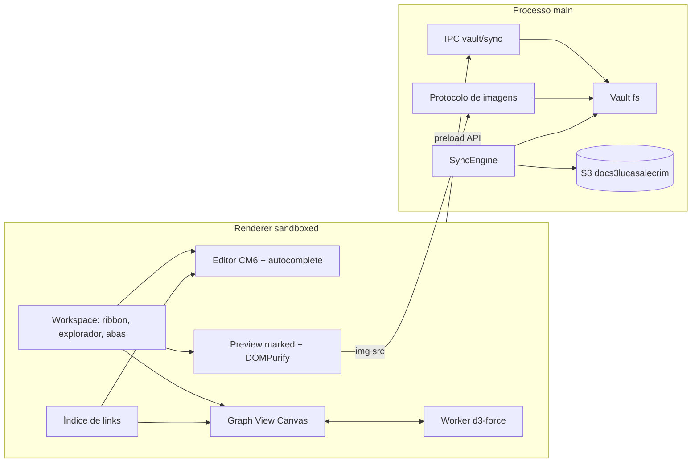

# Architecture diagrams

```mermaid
flowchart LR
  subgraph Renderer [Renderer sandboxed]
    UI[Workspace: ribbon, explorador, abas] --> ED[Editor CM6 + autocomplete]
    UI --> PV[Preview marked + DOMPurify]
    UI --> GV[Graph View Canvas]
    IDX[Índice de links] --> GV
    IDX --> ED
    GV <--> W[Worker d3-force]
  end
  subgraph Main [Processo main]
    IPC[IPC vault/sync] --> V[Vault fs]
    PR[Protocolo de imagens] --> V
    SE[SyncEngine] --> V
    SE --> S3[(S3 docs3lucasalecrim)]
  end
  Renderer -- preload API --> IPC
  PV -- img src --> PR
```
